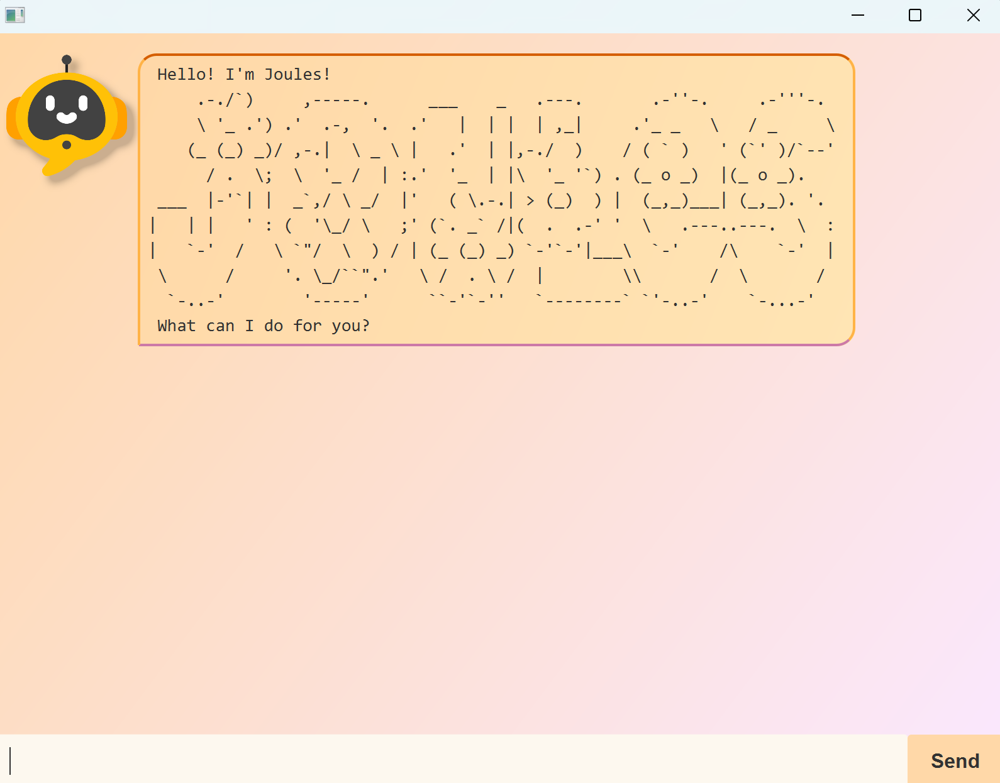

# Joules project

Joules is a personal assistant designed to help users manage tasks and contacts with energy and clarity. Inspired by project Duke, Joules adds a layer of personality and memory, making task management feel more human and intuitive.
Refer to Joules' user guide here: https://joulenergy.github.io/ip/

## Setting up in Intellij

Prerequisites: JDK 17, update Intellij to the most recent version.

1. Open Intellij (if you are not in the welcome screen, click `File` > `Close Project` to close the existing project first)
1. Open the project into Intellij as follows:
   1. Click `Open`.
   1. Select the project directory, and click `OK`.
   1. If there are any further prompts, accept the defaults.
1. Configure the project to use **JDK 17** (not other versions) as explained in [here](https://www.jetbrains.com/help/idea/sdk.html#set-up-jdk). 
   In the same dialog, set the **Project language level** field to the `SDK default` option.
1. After that, locate the `src/main/java/Launcher.java` file, right-click it, and choose `Run Launcher.main()` (if the code editor is showing compile errors, try restarting the IDE). If the setup is correct, you should see something like the below open in a window:

**Warning:** Keep the `src\main\java` folder as the root folder for Java files (i.e., don't rename those folders or move Java files to another folder outside of this folder path), as this is the default location some tools (e.g., Gradle) expect to find Java files.

## Credit
AI like ChatGPT and Copilot have been used to generate JavaDoc for some of the functions.