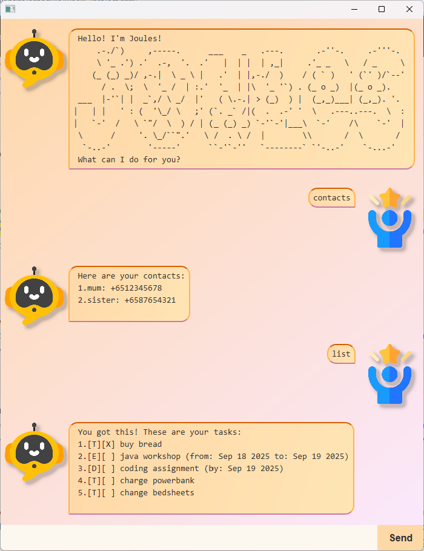

# ⚡Joules User Guide



Joules is a personal assistant chatbot designed to help users manage tasks and contacts with energy and clarity. Inspired by project Duke, Joules adds a layer of personality and memory, making task management feel more human and intuitive.

# 📘 Joules Features
Joules helps you manage your tasks with simple, intuitive commands.
> **Note:**
> Words in <> are the parameters to be supplied by the user.
> e.g. in `todo <description>`, `<description>` is a parameter which can be used as `todo math assignment`

##  List of Features
  - [Task Management](#-task-management)
    - [Add task](#-add-task-todo-deadline-event)
    - [List all tasks](#-list-all-tasks-list)
    - [Change status of task](#-change-status-of-task-mark-unmark)
    - [Delete task](#-delete-task-delete)
    - [Search tasks](#-search-tasks-find)
  - [Contact Management](#-contact-management)
    - [Add contact](#-add-contact-addc)
    - [List all contacts](#-list-all-contacts-contacts)
    - [Delete contact](#-delete-contact-deletec)
    - [Search contacts](#-search-contacts-findc)
  - [Persistence](#-persistence)
  - [Exit](#-exit-bye)

## 📋 Task Management
### ➕ Add Task: `todo`, `deadline`, `event`
Formats:
- `todo <description>`
  Adds a ToDo task.
- `deadline <description> /by <yyyy-mm-dd>`
  Adds a Deadline task with a due date.
- `event <description> /from <yyyy-mm-dd> /to <yyyy-mm-dd>`
  Adds an Event task with a scheduled date.

Example: `event java crash course /from 2025-09-19 /to 2025-09-20`

### 📜 List all tasks: `list`
Format: `list`

Displays all current tasks with their type of task and status of completion.

Example Output: 
```
1.[T][X] buy vegetables
2.[D][ ] coding assignment (by: Sep 19 2025)
```

### 🔁 Change status of task: `mark`, `unmark`
Formats:
- `mark <task number>`
  Marks a task as done. Task number is 1-indexed.
- `unmark <task number>`
  Marks a task as not done. Task number is 1-indexed.

Example: `mark 1`

### ⌫ Delete task: `delete`
Format: `delete <task number>`

Deletes the specified task at position number in the task list

Example: `delete 2`

### 🔍 Search tasks: `find`
Format: `find <keyword>`

Lists tasks that contain the given keyword in their descriptions.

Example: `find assignment`

## 👥 Contact Management
### ➕ Add Contact: `addc`
Format: `addc <name> <contact number>`

Adds a contact. Contact number must have a country code in front of it. 

Example: `addc mum +6512345678`

### 📜 List all contacts: `contacts`
Format: `contacts`

Displays all current contacts. 

Example Output: 
```
1.mum: +6512345678
2.sister: +6587654321
```

### ⌫ Delete contact: `deletec`
Format: `deletec <contact index>`

Deletes the specified contact. Contact index is 1-indexed.

Example: `deletec 1`

### 🔍 Search contacts: `findc`
Format: `findc <keyword>`

Lists contacts that contain the given keyword in their contact name or number.

Example: `findc +65`

## 💾 Persistence
Tasks and Contacts are automatically saved locally and reloaded when you restart Joules.

## 🚪 Exit: `bye`
Format: `bye`

Exits the chatbot gracefully.